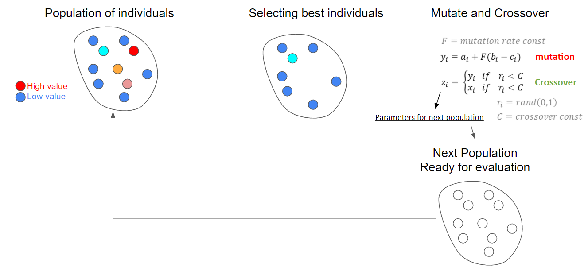
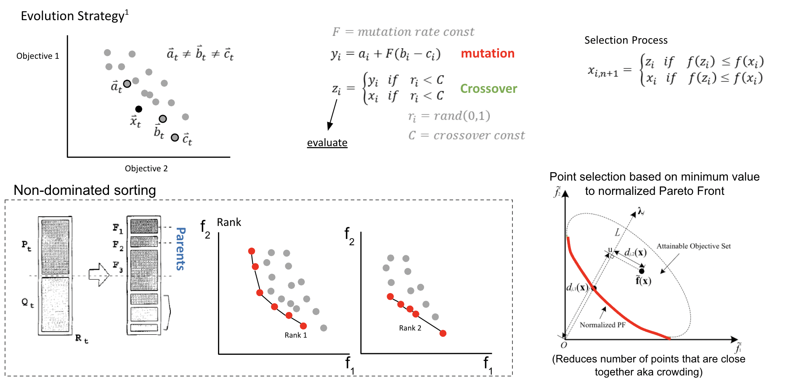
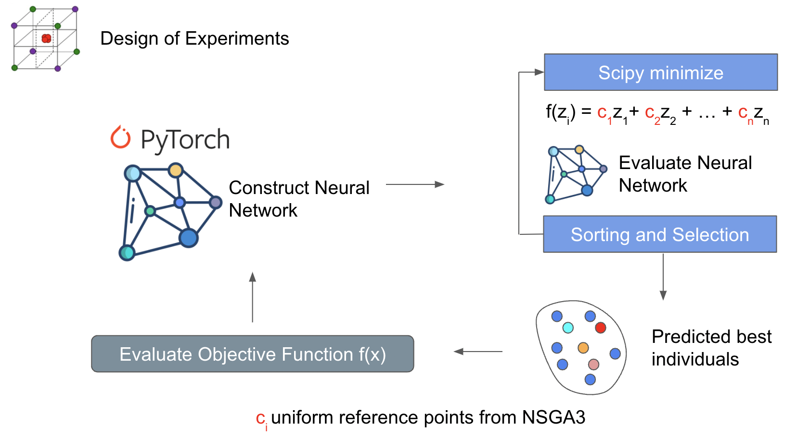

Optimizers
===============================

SODE - Single Objective Differential Evolution
------------------------------------------------
Single objective differential evolution works by generating a random set of individuals (design of experiments) that sample your domain. So if your domain is x1 = [-4,4], x2 = [-10,10], and x3=[0,5]. Each individual will be a vector of [x1,x2,x3] with randomly generated values between the bounds for x1, x2, and x3. There's many different ways to produce a design of experinents, but the goal is to sample the space and see what's best performing. The best performing individuals are then mutated and crossover with each other to produce the next set. The next set is then evaluated for it's performance and the best are selected for mutation and crossover. 

The image below illusrates and example of the cycle. 

Storn, R., & Price, K. (1997). Differential evolution–a simple and efficient heuristic for global optimization over continuous spaces. Journal of global optimization, 11(4), 341-359.

NSGA3 / NSGA-III- Non-Dominated Sorting Genetic Algorithm 
---------------------------------------------------------------
When doing multi-objective optimization, instead of finding a single value that is your minimum, you have a minimums for all your objectives and the points in between represent a compromise between your objectives. Drawing a line through these points is the pareto front. 

An expansion of single objective differential evolution can be carried out to multiple dimensions using a sorting algorithm. The top row of the figure is similar to what you would see for single objective differential evolution. However the bottom shows a sorting strategy called Non-Dominated Sorting. This method is used to filter out designs that minimize all the objectives by ranking them. However you can end up with crowding which is when designs are clustered together near each other. This isn't good for diversity and can lead to optimizers being stuck in local minimas. Which is why the authors do a point selection based on the closesness to a normalized pareto front.

Yuan, Y., Xu, H., & Wang, B. (2014, July). An improved NSGA-III procedure for evolutionary many-objective optimization. In Proceedings of the 2014 annual conference on genetic and evolutionary computation (pp. 661-668).

NSGA3_ML - Non-Dominated Sorting Genetic Algorithm with Machine Learning Surrogate
-----------------------------------------------------------------------------------
An expansion on the NSGA-III algorithm by incorporating a machine learning surrogate model. This surrogate model estimates the values of your objectives in the design space. NSGA is used to predict the performance inside an internal loop. The results are then evaluated by the objective function. Doing it this way minimizes the actual execution of the objective function. If your objective function is CFD, this can save some time. However there are many downsides towards doing this way. One of those is overfitting of the neural network. This can lead to inaccurate solutions near the pareto front. Over evaluation of the neural network can lead to clusterings near local minimas. 

.. image:: ../images/nsga_surrogate_overview.png
  :width: 600

NSOPT - Non-Dominated sorting optimization using Scipy 
--------------------------------------------------------

This method uses parts of NSGA3 to construct objective functions that use scipy to search for designs that can find the pareto. A weighted summation method is used to construct the various objective functions and scipy.minimize is the searching stratregy for the pareto front. One of the downsides towards using a weighted sum is it's poor ability to search for non-convex pareto fronts. This strategy is interesting because it has the capability to use gradient based minimization methods from scipy. More improvements will be made in the future to improve pareto front search capabilities.

Weighted sum: https://www.sciencedirect.com/topics/computer-science/weighted-sum-method
Weight sum limitations: https://youtu.be/yc9NwvlpEpI?t=1945 
Scipy minimize methods: https://docs.scipy.org/doc/scipy/reference/generated/scipy.optimize.minimize.html

